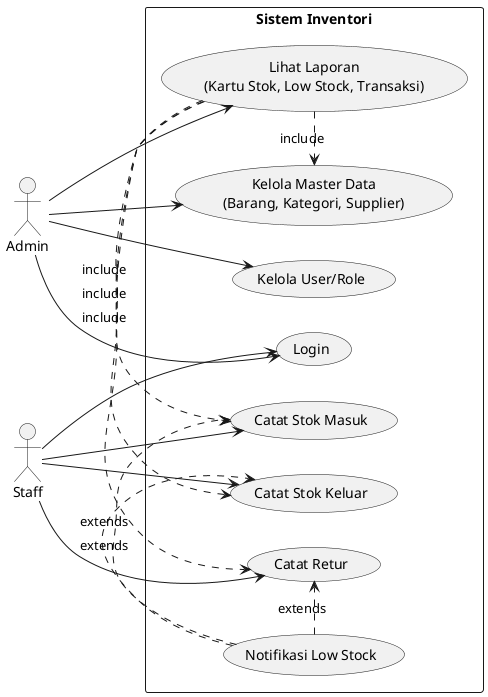
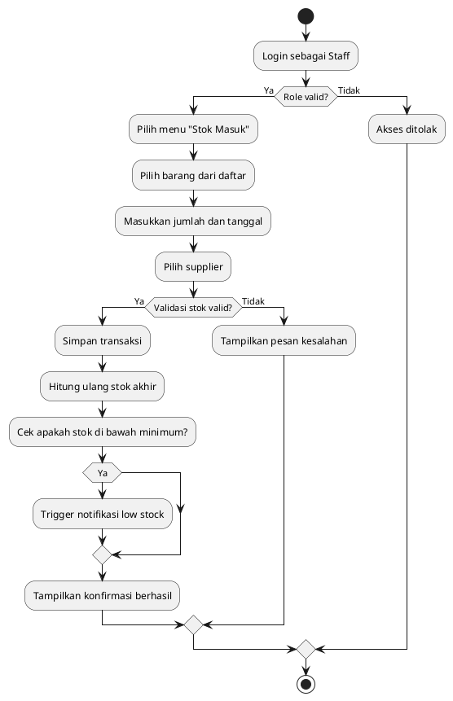
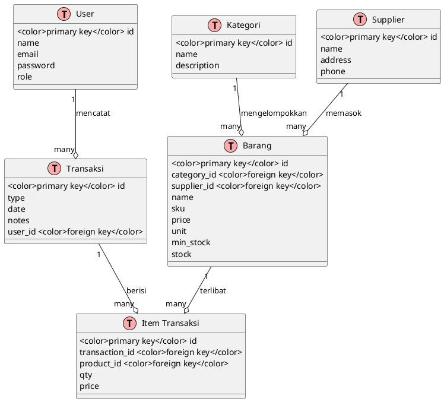

# PRD: Sistem Manajemen Inventori Berbasis Web

> **Versi:** 1.0 · **Status:** Draft · **Tanggal:** 2025-04-05 · **Penulis:** PRD Engine Pro

---

## 1. Ringkasan (Overview)

Sistem Manajemen Inventori Berbasis Web adalah solusi digital yang dirancang untuk membantu usaha menengah dan besar mengelola seluruh aspek inventarisasi barang secara terpusat dan efisien. Sistem ini mencakup pengelolaan master data (barang, kategori, supplier, pengguna/peran), pencatatan transaksi stok (stok masuk, stok keluar, retur), hingga pembuatan laporan real-time seperti kartu stok, notifikasi low stock, dan laporan transaksi per periode.

Dengan autentikasi berbasis peran (admin/staff), sistem ini memastikan kontrol akses yang aman dan sesuai dengan tanggung jawab masing-masing pengguna. Tujuannya adalah meningkatkan akurasi data, mengurangi risiko kehabisan stok, dan mempercepat proses pengambilan keputusan operasional.

Tech stack utama meliputi **Laravel 13** sebagai backend, **MySQL** sebagai database, **Livewire** untuk frontend dinamis, dan deploy di **VPS** untuk fleksibilitas dan kontrol infrastruktur.

---

## 2. Tujuan & Sasaran

| No | Tujuan | Sasaran Kunci Keberhasilan |
|----|--------|----------------------------|
| 1 | Pusatkan pengelolaan data inventori | Semua entitas master terhubung dalam satu sistem dengan konsistensi data >99% |
| 2 | Automatisasi pencatatan stok | Penggunaan manual turun <10%, sistem otomatis menghitung stok berdasarkan transaksi |
| 3 | Deteksi dini stok rendah | Notifikasi low stock muncul sebelum stok habis, mengurangi kehaburan stok hingga 70% |
| 4 | Verbesserung pengambilan keputusan | Laporan siap pakai tersedia dalam 30 detik, akurasi laporan ≥99% |
| 5 | Kontrol akses berbasis peran | Admin memiliki akses penuh; staff terbatas pada modul transaksi sesuai perannya |

---

## 3. Target Pengguna & Persona

### Segmen Utama
- **Ritel**
- **Distribusi**
- **Gudang Logistik**

### Persona Pengguna

#### 1. **Admin / Manajer Operasional**
- **Peran**: Mengatur konfigurasi sistem, mengelola pengguna & peran, mengakses laporan kritis.
- **Kebutuhan**: Kontrol penuh atas data, visibilitas lengkap, dan laporan akurat.
- **Motivasi**: Memastikan operasional berjalan lancar tanpa kehaburan stok.

#### 2. **Staff Operasional / Kasir / Staf Gudang**
- **Peran**: Memasukkan/mencatat transaksi harian (stok masuk/keluar/retur).
- **Kebutuhan**: Antarmuka sederhana, cepat, dan responsif untuk transaksi berulang.
- **Motivasi**: Efisiensi waktu, akurasi input, dan pengingat stok otomatis.

---

## 4. Masalah yang Dipecahkan

1. **Kesulitan melacak pergerakan stok secara real-time**
   - Akibat penggunaan sistem terpisah atau pencatatan manual yang rentan kesalahan.
2. **Keterlambatan deteksi stok rendah**
   - Menyebabkan kehabisan barang dan kehilangan penjualan.
3. **Kompleksnya pengelolaan data master**
   - Data barang, kategori, dan supplier tersebar dan sulit dikelola secara konsisten.

---

## 5. Use Cases / User Stories

### Use Case Diagram

---

## 6. Alur Pengguna (User Flow)

### Activity Diagram – Proses Transaksi Stok Masuk

---

## 7. Kebutuhan Fungsional & Fitur Utama (MVP)

| Fitur | Prioritas (MoSCoW) | Deskripsi |
|-------|---------------------|-----------|
| Auth: Login | Must have | Pengguna dapat masuk ke sistem dengan kredential yang valid. |
| Auth: Role-based Access | Must have | Admin memiliki akses penuh; staff terbatas pada transaksi. |
| Master Data: Barang | Must have | CRUD data barang termasuk nama, kode, harga, satuan, stok minimum. |
| Master Data: Kategori | Must have | Grup barang berdasarkan kategori untuk filter dan laporan. |
| Master Data: Supplier | Must have | Daftar supplier lengkap dengan kontak. |
| Transaksi: Stok Masuk | Must have | Pencatatan barang masuk dari supplier, update stok otomatis. |
| Transaksi: Stok Keluar | Must have | Pencatatan pengeluaran barang, mis. penjualan atau penggunaan. |
| Transaksi: Retur | Must have | Pencatatan retur barang dari customer/supplier. |
| Laporan: Kartu Stok | Must have | Riwayat transaksi per barang dalam periode tertentu. |
| Laporan: Low Stock | Must have | Daftar barang dengan stok di bawah ambang minimum. |
| Laporan: Transaksi Periode | Must have | Ringkasan semua transaksi dalam rentang waktu tertentu. |
| Kelola User & Role | Should have | Admin dapat menambah/edit/menghapus pengguna dan peran. |
| Notifikasi Low Stock | Should have | Sistem memberi notifikasi visual/email saat stok rendah. |
| Backup Database | Could have | Fitur backup otomatis data harian. |
| Export Laporan | Won't have (this time) | Ekspor laporan ke Excel/PDF akan dikembangkan di fase berikutnya. |

---

## 8. Kriteria Penerimaan (Acceptance Criteria)

### Fitur: Login

**Given** pengguna sudah terdaftar  
**When** mengisi email dan password valid  
**Then** sistem mengarahkan ke dashboard sesuai perannya  

### Fitur: Stok Masuk

**Given** pengguna sudah login sebagai staff  
**When** memilih menu stok masuk dan memasukkan detail transaksi valid  
**Then** sistem menyimpan transaksi dan memperbarui stok akhir barang  

### Fitur: Low Stock

**Given** stok barang mendekati atau di bawah minimum  
**When** terjadi transaksi yang memengaruhi stok  
**Then** sistem menampilkan notifikasi dan menampilkan daftar low stock di laporan  

### Fitur: Kartu Stok

**Given** transaksi sudah tercatat  
**When** manajer membuka kartu stok untuk suatu barang  
**Then** sistem menampilkan riwayat transaksi, masuk, keluar, retur, dan saldo akhir secara kronologis  

### Fitur: Role-Based Access

**Given** pengguna login dengan role staff  
**When** mencoba mengakses menu kelola user  
**Then** sistem menampilkan pesan akses ditolak  

---

## 9. Kebutuhan Non-Fungsional (NFR)

| Kategori | Persyaratan | Target |
|----------|-------------|--------|
| Performa | Respons halaman < 500ms pada koneksi stabil | < 300ms rata-rata |
| Keamanan | Enkripsi password (bcrypt), HTTPS, proteksi SQL Injection/XSS | OWASP Top 10 compliant |
| Skalabilitas | Mendukung hingga 100 pengguna bersamaan | Horizontal scaling-ready |
| Ketersediaan | Sistem harus tersedia saat dibutuhkan | SLA uptime 99.9% |
| Usability | UI/UX responsif dan intuitif | Score ≥80% pada tes pengguna |
| Maintainability | Modular, dokumentasi kode jelas | Dokumentasi tiap modul tersedia |
| Kompatibilitas | Dukung browser modern (Chrome, Firefox, Edge) | Chrome/Firefox latest -2 versi |

---

## 10. Fitur Lanjutan (Post-MVP)

| Fitur | Deskripsi | Estimasi Rilis |
|-------|-----------|----------------|
| Export Laporan | Export ke format PDF/XLSX | Fase 2 |
| API Public | REST API untuk integrasi eksternal | Fase 2 |
| Audit Trail | Rekam jejak semua aktivitas pengguna | Fase 3 |
| Multi-Warehouse | Dukungan gudang ganda | Fase 3 |
| Mobile App | Aplikasi mobile untuk transaksi cepat | Fase 4 |
| AI Prediksi Stok | Prediksi permintaan menggunakan ML | Fase 5 |

---

## 11. Arsitektur Teknis

### Frontend
- **Teknologi**: Livewire (Laravel)
- **Alasan**: Memungkinkan pengembangan interaktif tanpa beban JavaScript berat, cocok untuk aplikasi bisnis berbasis server-side rendering.

### Backend
- **Teknologi**: Laravel 13
- **Alasan**: Framework PHP yang stabil, komunitas kuat, dan mendukung autentikasi, routing, dan manajemen data dengan baik.

### Database
- **Teknologi**: MySQL
- **Alasan**: Open-source, andal, dan kompatibel dengan Laravel. Cocok untuk transaksi data inventori dengan struktur relasional.

### Deployment & Infrastruktur
- **Platform**: VPS (DigitalOcean / AWS / Linode)
- **Alasan**: Memberi kontrol penuh atas server, keamanan, dan performa. Cocok untuk deployment skala menengah.

---

## 12. Skema Data (High-Level)

### Entity Relationship Diagram (ERD)

---

## 13. API & Integrasi Eksternal

- **API Internal**: Digunakan untuk komunikasi antar-modul (mis. pencatatan stok otomatis saat transaksi dilakukan).
- **Integrasi Eksternal (Post-MVP)**:
  - Email gateway (notifikasi low stock)
  - WhatsApp gateway (notifikasi penting)
  - Export API ke sistem akuntansi/ERP

---

## 14. Metrik Sukses (KPI)

| KPI | Target |
|-----|--------|
| Akurasi stok sistem vs fisik | ≥ 95% |
| Waktu rata-rata pencatatan transaksi | ≤ 30 detik |
| Persentase notifikasi low stock yang ditindaklanjuti | ≥ 80% |
| Jumlah pengguna aktif per bulan | ≥ 80% dari total user terdaftar |
| Response time halaman dashboard | ≤ 300ms |
| Downtime sistem per bulan | ≤ 43 menit (99.9%) |

---

## 15. Risiko & Mitigasi

| Risiko | Dampak | Mitigasi |
|--------|--------|----------|
| Input data tidak akurat | Stok tidak sesuai kenyataan | Validasi input, audit log, konfirmasi double entry |
| Koneksi database lambat | Performa sistem menurun | Caching, indexing, optimasi query |
| Kebocolan data pengguna | Keamanan sistem terancam | Enkripsi, firewall, audit keamanan rutin |
| Kegagalan server | Downtime sistem | Backup harian, failover server, monitoring aktif |
| Kurangnya pelatihan pengguna | Adoption rendah | Pelatihan onboarding + dokumentasi pengguna |

---

## 16. Roadmap & Milestones (3–6 Bulan Pertama)

| Bulan | Fokus | Deliverables |
|-------|-------|--------------|
| Bulan 1 | Setup & Auth | Auth, role management, halaman login/dashboard |
| Bulan 2 | Master Data | CRUD barang, kategori, supplier |
| Bulan 3 | Transaksi Dasar | Stok masuk, stok keluar, retur |
| Bulan 4 | Laporan MVP | Kartu stok, low stock, transaksi periode |
| Bulan 5 | Testing & Bug Fixes | Uji coba internal + perbaikan |
| Bulan 6 | Go Live & Dokumentasi | Deploy produksi + dokumentasi pengguna |

---

## 17. Asumsi & Out-of-Scope

### Asumsi
- Pengguna memiliki akses internet stabil.
- VPS sudah disiapkan oleh tim infrastruktur.
- Admin sistem akan melakukan pelatihan internal kepada staff.
- Semua data master akan diinput manual pada fase awal.

### Out-of-Scope
- Integrasi dengan sistem akuntansi (mis. ERP/Zahir) — akan dikembangkan di fase lanjutan.
- Aplikasi mobile native — hanya dukungan web responsif.
- Penggunaan AI untuk prediksi stok — fokus pada sistem dasar dulu.
- Sinkronisasi multi-gudang — hanya satu lokasi gudang yang didukung pada MVP.

--- 

*Dokumen ini dapat direvisi sesuai masukan tim teknis, UX, dan stakeholder bisnis.*